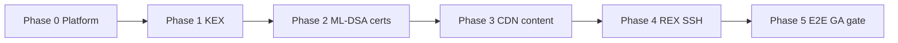

# PQC Phased Performance Test Plan

> **Unified doc:** [satellite-pqc-performance-impact.md](./satellite-pqc-performance-impact.md) §12.

Phased approach aligned with [SAT-36255](https://redhat.atlassian.net/browse/SAT-36255) (Phase 1 = KEX, Phase 2 = ML-DSA certs) and feature pillars under [SAT-35690](https://redhat.atlassian.net/browse/SAT-35690).

**SLO definitions:** [pqc-performance-slos.md](./pqc-performance-slos.md)  
**satperf root:** `redhat-performance/satperf/`

---

## Phase overview



| Phase | Focus | Crypto policy | Primary JIRAs | Exit criteria |
|-------|--------|---------------|---------------|---------------|
| 0 | RHEL 10 + Satellite install parity | DEFAULT | SAT-42784 | Install/migrate pass; baseline metrics captured |
| 1 | TLS PQC KEX only | DEFAULT:PQ or PQ subpolicy without ML-DSA certs | SAT-36257, SAT-38970 | SLO-10 met; matrix ≥90% pass |
| 2 | ML-DSA certificates + mTLS | Full PQC + dual certs | SAT-43394, SAT-38910, SAT-36257 | SLO-1,2,3,11 met; proxy+certguard E2E |
| 3 | CDN + ML-DSA content | Full PQC | SAT-43401, SAT-36256, SAT-38909/912 | SLO-4,5,6,7,8 met |
| 4 | REX over PQC SSH | Full PQC | SAT-43331, RHELBU-3378 | SLO-9 met |
| 5 | GA regression | Production-like | SAT-35690 | All SLO-1–12; 2x weekly green |

---

## Phase 0 — Platform baseline

**Goal:** Valid Satellite on RHEL 10 without PQC-specific variables (establish baseline).

### Tests

| ID | Scenario | Playbook | Metrics |
|----|----------|----------|---------|
| P0-1 | Fresh install | `playbooks/satellite/installation.yaml` | Install duration, service health |
| P0-2 | Registration baseline | `playbooks/tests/concurrent_execution.yaml` | SLO-1/2 baseline (classical crypto) |
| P0-3 | Repo sync baseline | `playbooks/tests/FAM/repo_sync.yaml` | SLO-4 baseline |
| P0-4 | REX baseline | `playbooks/tests/rex.yaml` | SLO-9 baseline |

### Environment

```yaml
# conf/satperf.local.yaml (example)
pqc_enabled: false
crypto_policy: DEFAULT
```

### Deliverable

- Baseline run directory: `run-<ts>/phase0-baseline/`
- Grafana snapshot exported for comparison

---

## Phase 1 — PQC key exchange (KEX only)

**Goal:** Verify PROFILE=SYSTEM / `DEFAULT:PQ` enables ML-KEM handshakes without ML-DSA cert cutover.

### Prerequisites

- RHEL 10.2+ lab
- SAT-36257 partial: Apache/crypto-policy only (no dual ML-DSA server certs required for KEX-only)

### Tests

| ID | Scenario | Playbook / method | SLO |
|----|----------|-------------------|-----|
| P1-1 | TLS handshake sweep | `openssl s_client` / scripted probe per vhost | SLO-10 |
| P1-2 | UI + API smoke | Manual + `api-get-task-duration.yaml` | SLO-10, SLO-12 |
| P1-3 | Component matrix | SAT-38970 matrix (functional) | Pass/fail grid |
| P1-4 | Registration with PQ KEX only | `concurrent_execution.yaml` | SLO-1 (compare to P0) |

### crypto-policy setup (Ansible ad-hoc)

```bash
# On Satellite + clients — verify policy name with RHEL 10.4 docs
update-crypto-policies DEFAULT:PQ
```

### Exit gate

- [ ] SLO-10 ≤ 130% baseline on Apache, Pulp, Candlepin endpoints
- [ ] SAT-38970 matrix ≥90% functional pass (no ML-DSA cert requirement)
- [ ] No increase in API error rate (SLO-12)

---

## Phase 2 — ML-DSA certificates

**Goal:** End-to-end subscription and content auth with ML-DSA identity/entitlement certs.

### Prerequisites

- CANDLEPIN-1021 code in Satellite build
- [SAT-43398](https://redhat.atlassian.net/browse/SAT-43398) spike complete → [SAT-38910](https://redhat.atlassian.net/browse/SAT-38910) solution deployed (Foreman↔Candlepin)
- Candlepin TLS 1.3 available or waived ([SAT-19326](https://redhat.atlassian.net/browse/SAT-19326) / probe in P1-1)
- CCT/subman builds with PQC opt-in ([CCT-1801](https://redhat.atlassian.net/browse/CCT-1801))

### Registration PR stack (apply before P2-2 storm)

Merge or `apply_prs` the registration performance stack **before** judging PQC registration SLOs. Without it, PQC failures may reflect **pre-existing** CP/TLS amplification, not ML-DSA alone.

**Reference:** [pqc-registration-pr-stack-impact.md](./pqc-registration-pr-stack-impact.md)

| Wave | PRs (minimum for PQC storm) |
|------|----------------------------|
| CP traffic | katello#11731, #11696, #11694 |
| Pooling | katello#11726 **or** #11754 (one) |
| DB | foreman#10979, #10980, katello#11701 |
| Reliability | foreman#10948, #10969 |
| Capsule | smart-proxy#935, #936 |
| foremanctl | #495 admission control (validate ×5 vs ×3 under PQC) |

### PQC registration comparison matrix (R0–R4)

| Run | `crypto_policy` | Patch stack | Topology | Purpose |
|-----|-----------------|-------------|----------|---------|
| R0 | `DEFAULT` | None | Direct + capsule | Classical baseline |
| R1 | `DEFAULT` | Full reg stack | Direct + capsule | Patched classical |
| R2 | `DEFAULT:PQ` | None | Direct + capsule | Raw PQC regression |
| R3 | `DEFAULT:PQ` | Full reg stack | Direct + capsule | **Target gate** (SLO-1/2/3) |
| R4 | `DEFAULT:PQ` | Full + foremanctl#495 | Direct (foremanctl) | Admission control under PQC |

`apply_prs` example and metrics: [pqc-registration-pr-stack-impact.md](./pqc-registration-pr-stack-impact.md#satperf-test-matrix-pqc).

### Tests

| ID | Scenario | Playbook | SLO |
|----|----------|----------|-----|
| P2-1 | Single host registration ML-DSA | `continuous-reg.yaml` | SLO-1, SLO-3 |
| P2-2 | Registration storm | `concurrent_execution.yaml` | SLO-2, SLO-13 — run **R3** matrix |
| P2-2b | Reg storm without patch stack | `concurrent_execution.yaml` | Diagnostic only (**R2**) |
| P2-3 | Dual-cert Apache load | `ab`/`hey` + concurrent HTTPS | SLO-10, SLO-13 |
| P2-4 | Manifest import ML-DSA | `FAM/manifest_import.yaml` | SLO-11 |
| P2-5 | Content pull mTLS | Client dnf install from CV | Functional + latency |
| P2-6 | pulp-certguard path | Authenticated pull at scale | CPU on pulpcore |

### New stories required (see integration-gaps.md)

- HTTP proxy ML-DSA mTLS
- pulp-certguard ML-DSA verification

### Exit gate

- [ ] SLO-1, SLO-2, SLO-3, SLO-11 met on **R3** (full reg stack + `DEFAULT:PQ`)
- [ ] R3 pass rate within **95%** of **R1** (patched classical) at same concurrency
- [ ] E2E: register → entitlement → dnf install succeeds
- [ ] SAT-38910 Done
- [ ] Registration perf PR stack merged or documented as release dependency

---

## Phase 3 — CDN and ML-DSA signed content

**Goal:** Connected Satellite sync/publish/promote with PQC CDN and ML-DSA signed RPMs.

### Prerequisites

- Akamai PQC staging endpoint (🔴 dependency)
- RHEL 10 ML-DSA signed test repository
- SAT-36256 implementation

### Tests

| ID | Scenario | Playbook | SLO |
|----|----------|----------|-----|
| P3-1 | CDN repo sync | `FAM/repo_sync.yaml`, `sync-repositories.yaml` | SLO-4, SLO-5 |
| P3-2 | CV publish | `FAM/cv_publish.yaml` | SLO-6 |
| P3-3 | CV promote | `FAM/cv_version_promote.yaml` | SLO-7 |
| P3-4 | Capsule sync | `FAM/capsule_sync.yaml` | SLO-8 |
| P3-5 | Disconnected Capsule client | Client on Capsule pulls ML-DSA RPM | Functional |

### Exit gate

- [ ] SLO-4 through SLO-8 met
- [ ] ML-DSA signature verification on client (rpm/dnf) confirmed
- [ ] Akamai dependency 🟢 or waived with disconnected-only doc

---

## Phase 4 — Remote execution (PQC SSH)

**Goal:** REX jobs over ML-KEM SSH per SAT-43331.

### Prerequisites

- [RHELBU-3378](https://redhat.atlassian.net/browse/RHELBU-3378) in client+Satellite SSH config
- RHEL 10.2+ managed hosts

### Tests

| ID | Scenario | Playbook | SLO |
|----|----------|----------|-----|
| P4-1 | Single-host REX | `rex.yaml` | SLO-9 |
| P4-2 | 100-host job | `rex.yaml` / FAM `job_invocation_create.yaml` | SLO-9 |
| P4-3 | Capsule-mediated REX | REX via Capsule to disconnected host | SLO-9 |

### Verification

```bash
# On target during REX — confirm hybrid KEX in sshd/sshd -T / connection logs
ssh -vvv ...
```

### Exit gate

- [ ] SLO-9 ≤ 120% baseline
- [ ] SAT-39004-style functional pass on REX plugin

---

## Phase 5 — GA regression suite

**Goal:** Single command regression for release candidates.

### Wrapper playbook (proposed)

Create `playbooks/tests/pqc/pqc-ga-regression.yaml` that imports:

1. Phase 1 TLS probes (abbreviated)
2. Phase 2 registration storm (medium scale)
3. Phase 3 one large repo sync + publish + promote
4. Phase 4 REX sample job

### Schedule

| When | Scope |
|------|--------|
| Per RC build | Full Phase 5 |
| Weekly main | Phase 1 + 2 subset |
| Nightly | P0 smoke on classical + PQ policy toggle |

### Reporting

- Publish comparison table: baseline vs PQ for each SLO
- Link results in SAT-35690 comment and PSASTRAT-109 status

---

## Proposed satperf variables

Add to `conf/satperf.yaml`:

```yaml
# PQC performance testing
pqc_enabled: false          # master switch
pqc_crypto_policy: DEFAULT:PQ
pqc_phase: 0                # 0-5 per this document
pqc_dual_cert: true         # Phase 2+
pqc_client_rhel_version: 10.2
```

---

## Risk-based test prioritization

If lab time is limited, run in this order:

1. **P2-2** Registration storm (highest customer visibility)
2. **P3-1** CDN sync (largest wall-clock jobs)
3. **P1-1** TLS handshake (cheapest signal for KEX regressions)
4. **P4-2** REX at scale
5. **P2-6** pulp-certguard CPU (silent hotspot)

---

## Related documents

- [pqc-performance-slos.md](./pqc-performance-slos.md)
- [pqc-registration-pr-stack-impact.md](./pqc-registration-pr-stack-impact.md)
- [pqc-integration-gaps.md](./pqc-integration-gaps.md)
- [sat-38970-restructure-proposal.md](./sat-38970-restructure-proposal.md)
- [pqc-issue-hierarchy.csv](./pqc-issue-hierarchy.csv)
